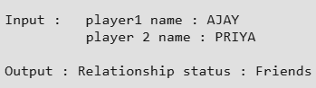
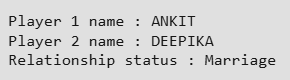

# 🔥 FLAMES Game in Python

FLAMES is a popular fun game named after the acronym:
**Friends, Lovers, Affection, Marriage, Enemies, Siblings**.

This Python program simulates the traditional FLAMES game using simple string and list operations.

---

## 🎯 How the Game Works

The program follows these steps:

### Step 1: Take Two Names
The user inputs two names.

### Step 2: Remove Common Characters
All common characters between the two names are removed, considering their occurrences.

### Step 3: Count Remaining Letters
The total count of leftover characters is calculated.

### Step 4: Apply FLAMES Logic
The count is used to eliminate letters from the FLAMES list in a circular manner until only one relationship remains.

---

## 🧠 Logic Breakdown

- Convert names to lowercase
- Remove spaces
- Convert names to lists
- Repeatedly remove matching characters
- Count remaining characters
- Use modulo arithmetic for circular elimination

---

## 🖼️ Screenshot

---

## 🤝 Contribution
Pull requests are welcome.  
If you'd like to improve this project, feel free to fork the repository and submit enhancements.
